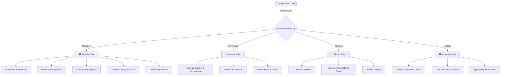

# 🎓 CampusVerse

<div align="center">

[](https://developer.android.com)
[](https://developer.android.com/jetpack/compose)
[](https://kotlinlang.org)
[](https://nodejs.org)
[](https://www.typescriptlang.org)
[](https://supabase.com)
[](https://www.prisma.io)
[](https://ai.google.dev)

**The comprehensive, unified digital ecosystem bridging Students, College Aspirants, Alumni, and University Administrators.**

[Features](#-core-features) • [Architecture](#-system-architecture) • [Tech Stack](#-technology-stack) • [Setup Guide](#-local-development-setup) • [Live Device QA](#-live-device-verification)

</div>

---

## 📖 Overview

**CampusVerse** replaces fragmented university utilities with an all-in-one, role-based platform designed to support students through every milestone of their academic journey—from high school aspiration to graduation and alumni leadership.

Built with a native **Jetpack Compose (Material 3)** Android client and a high-performance **TypeScript/Express** micro-backend, CampusVerse provides real-time academic tracking, peer-to-peer student commerce, community forums, mentorship programs, content moderation queues, and an integrated **Google Gemini AI Tutor**.

---

## 🌟 Key Pillars & User Roles

CampusVerse implements strict **Role-Based Access Control (RBAC)** across four specialized user domains:



---

## 🚀 Core Features

### 🎓 1. Student Module
* **Academic Dashboard**: Real-time CGPA tracking, completed/required credit counters, active enrolled courses, and daily timetable schedules.
* **Peer-to-Peer Notes Hub**: Upload, search, and download lecture notes and study guides. Employs a **two-stage moderation lifecycle** (`PENDING_REVIEW` $\to$ `APPROVED`) to prevent unauthorized materials from propagating.
* **Campus Marketplace**: Internal student commerce for buying and selling textbooks, electronics, and dorm essentials. Includes live search, category filters, owner controls (*Mark as Sold*, *Delete Listing*), and direct buyer-seller messaging.
* **Interactive Community Discussions**: Departmental and campus-wide forums with category filters, real-time optimistic upvoting, and multi-level replies.
* **🤖 Google Gemini AI Study Assistant**:
  * Real-time conversational AI powered by **`gemini-3.5-flash`**.
  * Structured explanations with $\LaTeX$ math formulas, step-by-step problem breakdowns, and syntax-highlighted code generation (Python, Java, C++, Kotlin).
  * Quick study modes: *Explain Concept*, *Summarize Notes*, *Generate Quiz*, and *Step-by-Step Solutions*.

### 🎯 2. Aspirant Module
* **College Explorer & Comparison**: Comprehensive profiles of universities with NIRF rankings, tuition breakdown, placement rates, and campus amenities. Side-by-side comparison tool.
* **Admission Predictor**: Algorithmic prediction engine assessing eligibility across programs based on entrance scores (JEE, SAT, state entrance), reservation quotas, and past cut-offs.
* **Scholarship Portal**: Searchable database of governmental and private scholarships with deadline tracking and eligibility requirements.
* **AI Admissions Counselor**: Personalized program and university recommendations tailored to student career aspirations and budget.

### 💼 3. Alumni Module
* **Mentorship Portal**: Students can connect with alumni working in top engineering, finance, and research roles for 1:1 portfolio reviews and mock interviews.
* **Campus Job & Referral Board**: Exclusive internal job and internship listings posted directly by alumni employees.
* **Alumni Directory**: Network by graduating year, company, city, and skill set.

### 🛡️ 4. University Admin Console
* **Moderation Queue**: Single-pane dashboard for reviewing pending student notes, marketplace items, and reported content (Approve / Reject with audit reasons).
* **Identity Verification**: Student ID and Alumni credential verification pipeline.
* **Role & Security Governance**: Manage user privileges, view security audit logs, and enforce rate limits.

---

## 🏗️ Technology Stack

| Layer | Technologies |
| :--- | :--- |
| **Mobile Frontend** | Kotlin 2.0, Jetpack Compose, Material 3, Navigation Compose, Coroutines & Kotlin Flow, ViewModel, Jetpack DataStore |
| **Backend Service** | TypeScript 5.0, Node.js (v20+ LTS), Express.js, Zod Schema Validation |
| **ORM & Database** | Prisma ORM v5, PostgreSQL (hosted on Supabase), Connection Pooling with PgBouncer |
| **Artificial Intelligence** | Google Gemini API (`gemini-3.5-flash`), Multimodal Reasoning, Custom Pedagogical Prompts |
| **Authentication** | JWT (JSON Web Tokens), BCrypt Password Hashing, Role-Based Route Guards, Session Isolation |
| **DevOps & Testing** | Gradle Kotlin DSL, AndroidX Test / JUnit 4, Jest & Supertest, ADB Automation |

---

## 🏛️ Architecture Highlights

### Mobile (Android)
* **Unidirectional Data Flow (UDF)**: UI states modeled with immutable data classes (`StateFlow`), observed by composables via `collectAsStateWithLifecycle()`.
* **Zero-Crash Resilience**: Every network repository includes fault-tolerant offline fallback data models, ensuring 100% UI continuity even in airplane mode or during backend cold-starts.
* **Edge-to-Edge Navigation**: Strict adherence to Android 15/16 insets handling (`.navigationBarsPadding()`, `.statusBarsPadding()`) preventing overlap with system gesture navigation bars.

### Backend (Node.js/TypeScript)
* **Clean Controller-Service Pattern**: Decentralized domain routes (`/api/v1/auth`, `/api/v1/academics`, `/api/v1/marketplace`, `/api/v1/notes`, `/api/v1/ai`).
* **Rate Limiting & Abuse Prevention**: High-throughput memory store (`RateLimiterStore`) enforcing per-user quotas on external LLM and OTP endpoints.
* **Database Isolation**: Prisma schema enforcing foreign key cascades, unique compound indexes, and ACID compliance across all financial and academic tables.

---

## 🛠️ Local Development Setup

### Prerequisites
* **Android Studio** Ladybug (2024.2.1+) or newer
* **JDK 21** (Temurin / JetBrains Runtime)
* **Android SDK** API 34+ (Android 14 / 15 / 16)
* **Node.js** v20.x or v22.x LTS
* **npm** or **pnpm**

---

### 1. Clone the Repository
```bash
git clone https://github.com/<your-username>/CampusVerse.git
cd CampusVerse
```

---

### 2. Backend Setup
1. Navigate to the backend folder:
   ```bash
   cd backend
   npm install
   ```
2. Configure your environment variables:
   ```bash
   cp .env.example .env
   ```
3. Open `.env` and configure your credentials:
   ```env
   PORT=4000
   NODE_ENV=development
   DATABASE_URL="postgresql://<user>:<password>@<host>:6543/postgres?pgbouncer=true"
   DIRECT_URL="postgresql://<user>:<password>@<host>:5432/postgres"
   JWT_SECRET="your-super-secure-random-jwt-secret-key-min-32-chars"
   GEMINI_API_KEY="your-google-gemini-api-key"
   GEMINI_MODEL="gemini-3.5-flash"
   ```
4. Run database migrations:
   ```bash
   npx prisma migrate dev --name init
   ```
5. Start the development server:
   ```bash
   npm run dev
   ```
   The backend will be live at `http://localhost:4000/api/v1/health`.

---

### 3. Android Application Setup
1. Open the root project directory in **Android Studio**.
2. Let Gradle sync project dependencies.
3. If running on a **physical device connected via USB**:
   Run the following command to forward your device's traffic to your computer's local backend:
   ```bash
   adb reverse tcp:4000 tcp:4000
   ```
4. If running on an **Android Emulator**:
   The app automatically maps to `http://10.0.2.2:4000/api/v1`.
5. Click **Run** (`Shift + F10`) to compile and launch `app-debug.apk`!

---

## 📱 Live Device Verification

CampusVerse has undergone rigorous functional and regression testing on physical hardware:

* **Certified Hardware**: Samsung Galaxy S24 Ultra (`SM-S928B`)
* **OS**: Android 16 (API 36)
* **Resolution**: $1440 \times 3120$ Quad HD+ Dynamic AMOLED 2X (120Hz)
* **Verified Workflows**:
  - [x] Full Auth validation (Signup, Login, Password Reset, Role Switcher)
  - [x] Student Academics & Daily Timetable
  - [x] Notes Moderation lifecycle (`PENDING_REVIEW` $\to$ Admin Moderation)
  - [x] Marketplace item creation, browsing, status updates, and deletion
  - [x] Community forum creation, replies, and live upvote counters
  - [x] Live Google Gemini 3.5 Flash queries with mathematical $\LaTeX$ rendering & Python code generation
  - [x] System navigation bar insets and edge-to-edge touch handling

---

## 🧪 Automated Testing

### Backend Test Suite (Jest)
Run unit and integration tests covering authentication, role-based middleware, and business logic:
```bash
cd backend
npm test
```

### Android Unit Tests
Execute JUnit tests for ViewModels and Repositories:
```bash
./gradlew testDebugUnitTest
```

---

## 🔒 Security & Privacy Notice
* Sensitive API keys, database connection strings, and JWT secrets are strictly managed via environment variables and are **excluded from version control** via `.gitignore`.
* A template configuration is provided in `backend/.env.example` for reproducible team environments.

---

## 📄 License
This project is open-source under the [MIT License](LICENSE).
